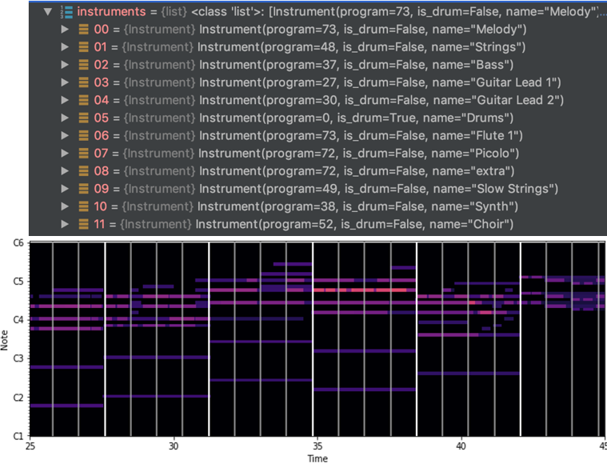

# Lyrics-Generation-Using-LSTM

## Overview
This project implements an LSTM-based model to generate song lyrics from melodies. The generation process is probabilistic, allowing diverse outputs for the same melody. The project combines advanced sequence modeling techniques with music and natural language processing.


---

## Project Structure

### Key Files
- **`config.py`**: Defines model architecture, training parameters, and data handling settings. Includes optimal configurations from experiments.
- **`word2vec.py`**: Handles text preprocessing and updates/loading of embedding models for lyrics.
- **`melody2vec.py`**: Processes MIDI files into feature vectors suitable for pairing with lyrics tokens.
- **`dataset.py`**: Prepares the dataset by pairing lyrics and melodies and chunking sequences for modeling.
- **`lstm.py`**: Implements the LSTM model for training and text generation, supporting bidirectional and unidirectional configurations.
- **`main.py`**: Command-line interface to build datasets, train the model, and generate text.
- **`mainColab.ipynb`**: Colab notebook for GPU-accelerated experiments, with `TensorBoard` integration for training visualization.
- **`requirements.txt`**: Lists dependencies for running the project.
- **`report.pdf`**: Detailed documentation (in Hebrew) outlining project decisions and experiments.

---

## Usage

### Dataset
The dataset includes lyrics and melodies for 607 songs, with 5 additional test songs. 

- **Dataset Preparation**:
  - Have a Data folder containing `midi_files` folder with the melody files and train / test files: `lyrics_train_set.csv` and `lyrics_test_set.csv`
  - Train and test files have 3 unnamed column for | Artist | Song Name | Lyrics |
  - Lyrics should replace `&` mark with `\n`, normalize `<Chorus>` token, and add `<BOT>` and `<EOT>` token.
  - Melody files are saved in folder where file name is `{Artist} - {Song Name}.mid`. You will need to replace `"_"` for `" "` when parsing. 

### Environment Setup
Ensure you have Python installed and follow these steps to set up the environment:

```bash
python -m venv venv
venv\Scripts\activate  # On Windows
pip install --upgrade pip
pip install -r requirements.txt
```

## Features
### Building the Model
Leverage an LSTM model with configurable layers, bidirectional options, and optional attention mechanisms to capture the relationship between melody and lyrics.

### Training
Train the model on a prepared dataset of song lyrics and melodies. Monitor performance using TensorBoard for loss visualization.

### Prediction
Generate song lyrics based on melody input and a starting token. Experiment with different temperature values for varied outputs.

---

## Results

Here is a sample of lyrics generated by the model (on the melody of All the Small Things by Blink 182).

**Lyrics by your favorite crappy AI musician - LuST.M**

```
[Info]: Generated sequence length: 128 tokens.
Generated Text:
say my heart ( dough conversation stolen corner walking off brightly high ) estoy alien with yourself to drowns
 blessed mystery you need me with the fingers wait collars somewhere somewhere
 hero life easily amsterdam they asshole castles anymore above your mind york minute
 am tape marshall
 cannot dependents fantasy yeah psychiatrist crawling on an walks on you through nothing named up ares spilled her effortlessly you frontiers mirage


Chorus:
 jackets haha yeah was impatiently holding africa your equipped creativity tomorrow bring me out when they are lupe hooo itself that look in bloom pain blinkered falling beautiful colors
 if a boudoir lay ?
 he in a sorry watch what you easy stack
 meeting offered there dawning
 no nono
```
Still better than poetry slam.

To conclude, the general idea of the task is nice, but I highly doubt the effectiveness of combining the melody context is predicting the word, unless using a much bigger dataset.
In the end, the bidirectional method generated what seemed to be better texts, which we assume resulted by the global usage of the melody, instead of using each group of notes as a context for each word.

## GitHub
### Initiating Git Repository
To clone this repository locally:
```
git init
git remote add origin https://github.com/shaharoded/Lyrics-Generation-Using-LSTM.git
git status
```
Alternatively, you can initialize a local repository:
```
git clone https://github.com/shaharoded/Lyrics-Generation-Using-LSTM.git
```

### Git Updates
To publish updates:
```
git add .
git commit -m "commit message"
git branch -M main
git push -f origin main
```